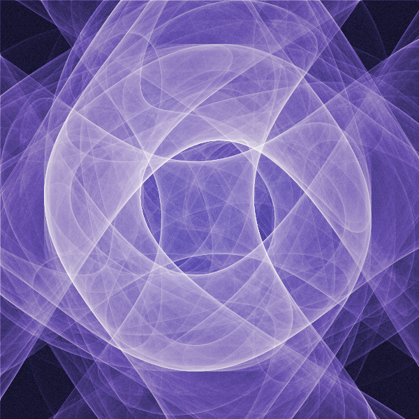

# ChaosKit Prototypes

ChaosKit is a piece of software that generates pictures of fractals (or rather [fractal flames](https://en.wikipedia.org/wiki/Fractal_flame)). The project started sometime before 2010 — at least that's the year on the oldest file I had lying around.

Since I'm typing this in November 2024, it's clear that a lot of time has passed since then. This repository is meant to document the journey from the beginning to the [last version of ChaosKit](https://github.com/ChaosKit/ChaosKit). There's heaps of bad code, cringeworthy file names and also some nice pictures alongside bad ones. Enjoy!

## What's inside

I wrote and rewrote the project from scratch _a lot_ of times. Most times I also took it as an opportunity to learn or play with another programming language. This is reflected in the directory structure of this repo. 

Each directory in the top level of the repository is one prototype. Inside, there's usually:

* the code (if I still have it, there might be also a link to the repo in the README)
* maybe a README file
* an `outputs` directory with pictures and output files from the program

Here are some words about the actual prototypes:

* [`01-ruby/`](./01-ruby) — My first and jankiest implementation <3
* [`02-delphi`](./02-delphi) — Rewrite in [Delphi](https://en.wikipedia.org/wiki/Delphi_(software)) (AKA Object Pascal) because I wanted more speed
* [`03-java`](./03-java) - Rewrite in Java with Swing because I wanted it to be cross-platform
* [`04-cpp`](./04-cpp) - Rewrite in C++ with GTK+2 after convincing [@strzkrzysiek](https://github.com/strzkrzysiek) to turn it into a university project
* [`05-coffeescript`](./05-coffeescript) — Rewrite in [CoffeeScript](https://en.wikipedia.org/wiki/CoffeeScript) with a pivot into implementing fractal flames, after I noticed similarities between them and my old approaches
* [`06-rust`](./06-rust) — Rewrite in Rust for more speed, again
* [`07-cpp-opencl`](./07-cpp-opencl) — Rewrite in C++ with OpenGL, OpenCL and [Dear ImGui](https://github.com/ocornut/imgui) to experiment with generating on the GPU
* [`08-cpp-qt`](./08-cpp-qt) — Rewrite in [Qt/QML]() to turn this into a full-fledged editor with a nice UI

## But why share all this? (A personal note)

Aside from a few exceptions that I'm very grateful for, for most of the time I've been chipping away at ChaosKit alone. Every now and then I found new, exciting ways for taking the project in new directions — new ways of coloring! computing on GPU! turning it into a freaking code interpreter! That all kept me going.

But then, every time I hit an issue, I spent lots of late evenings trying to solve it, searching all over the internet. I spent lots of time rewriting the same parts over and over from one version to another (don't get me started on OpenGL boilerplate). The project became daunting from all the scope creep. I wasn't getting any motivation or fun from it anymore. So, one day in 2021, I decided to stop.

I wasn't thinking about ChaosKit since then. Well, I wasn't until I recently watched [Lu Wilson's](https://todepond.com) talk ["What it means to be open"](https://www.youtube.com/watch?v=MJzV0CX0q8o). That talk made me start reflecting on this entire journey and how it's been _the opposite_ of open. I realized that in reality, I was afraid of sharing ChaosKit, of all the potential criticism I could get. I was afraid that I couldn't handle it.

I don't want to be afraid anymore.

So, here it is, a big, scrappy dump of _stuff_ that's very much not perfect. This thing taught me a lot and I hope you enjoy it. But beware, there are gaps the size of Jupiter!

## Questions?

Feel free to ask questions, I'm happy to answer.

* Fediverse/Mastodon: [@evol@evolved.systems](https://social.evolved.systems/@evol)
* Matrix: [@evol:evolved.systems](https://matrix.to/#/@evol:evolved.systems)

## License

Unless mentioned otherwise:

* All the software (code and binaries) is licensed under the [2-Clause BSD License](./LICENSE.software.txt).
* All the images and outputs are licensed under [CC BY-SA 4.0](./LICENSE.outputs.txt).
